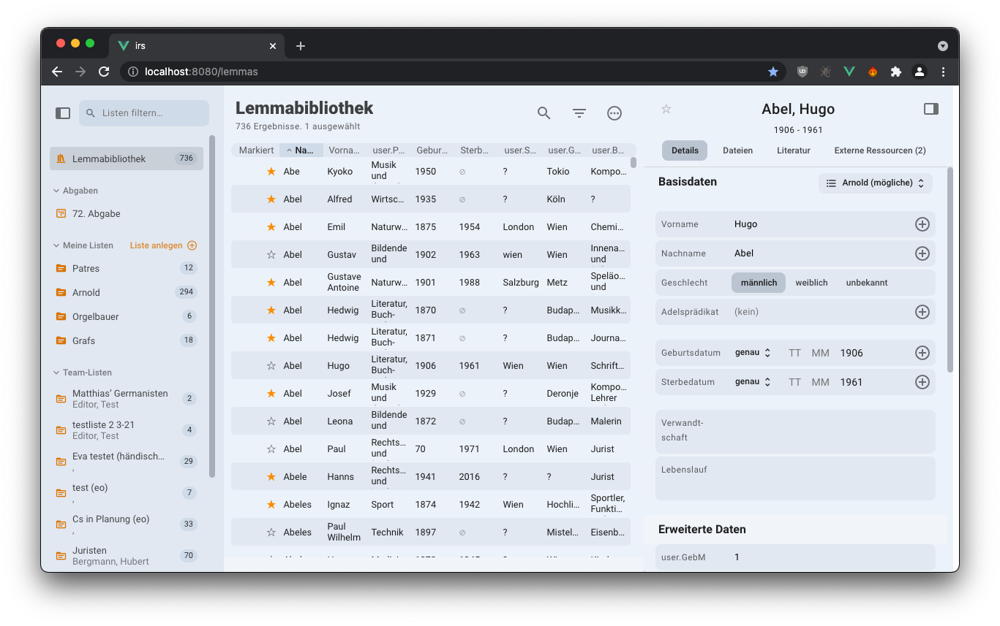
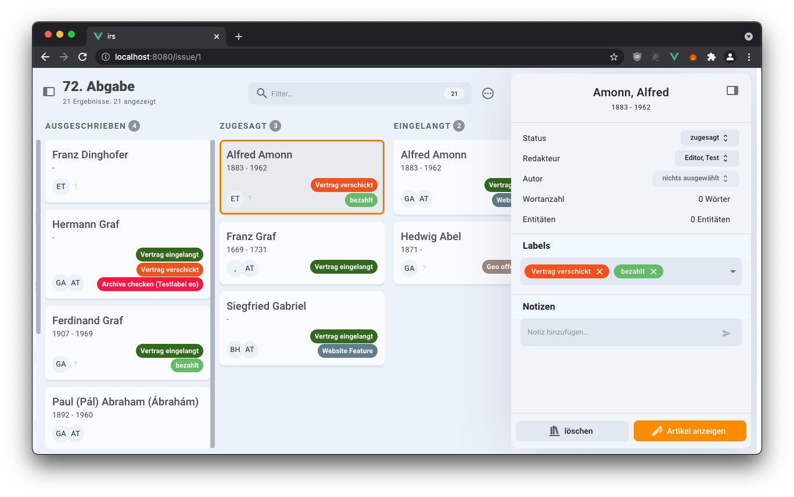
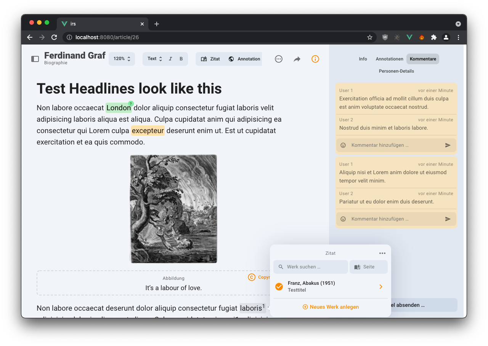

# IRS

## Integriertes Redaktionssystem

The application consists of three main parts:

### 1. The Research Tool

*Lemmas* (specifically persons of historical interest) can be entered manually or batch-imported into the Research Tool. The Research Tool will then try to find the Lemma’s GND (its norm-data Identifier). Once found, it triggers an asynchronous scrape job on the server that tries to find additional information on the subject in various catalogues and databases. This information is then displayed under "Externe Ressourcen". If a GND could not be found automatically, it can be selected manually. All Lemmas can be organized into lists/folders (displayed in the left hand side bar) via drag-and-drop. They can be searched, and filtered by all attributes.



### 2. The Issue Manager

Once a Lemma is selected for publication, it can be added to an *Issue* (”Abgabe”). Inside the Issue/Abgabe, an *Article*’s status can change by moving it from column to column. The natural progression of an Article over time would be left-to-right. Tags can be used to categorize the Articles further and to add important organizational details (such as the payment status, whether the Article is delayed, etc.). In the Issue Manager, the Articles are assigned to Editors.



### 3. The Article Editor

The Article editor is specifically designed for editing and annotating scientific texts.



## Development

### Basics

The application uses Vue 2.x with Vuetify 2.x as a UI component library, and uses custom UI Elements only if necessary (see `src/views/lib`). All components are written in Typescript with the Class Component Decorators for more idiomatic structure. Tests are run with Cypress. The color scheme of the application is defined in `src/plugins/vuetify.ts`

### REST API calls / RPC

The Back End provides an OpenAPI (née Swagger) spec. By calling `npm run get-api-types` the spec is downloaded and transformed into a statically typed TS API client. All calls to the Back End are then made through this API client. The auto-generated types are also used extensively throughout the code base.

### State Management

The application state is not stored inside a traditional Vuex State Container, but instead in bare Typescript classes located in `src/store`. Their instance methods are also used to mutate their state.

Currently, all Lemmas are stored, searched and filtered on the client in an IndexedDB table (called `LemmaDb`). On start-up, we fetch the updates, inserts and deletions from the server, and update the local database accordingly (all of this happens in the lemma class / store).

### Real-Time Synchronization

Clients keep each other up to date by connecting to a remote Event Bus, provided by the built in Node.js server (see `/server`). Clients receive Events when the data is changed by another. The Back End can also send specific types of Events by `POST`ing to paths starting with `/message`, for instance when a Lemma’s scrape data is updated by the server. `NotifyEvents` are strictly typed and thus enumerated in `./src/service/notify`.

### Zotero data caching

Upon initialization the built in server starts caching responses from the Zotero API that barely ever change (specifically the ItemTypeFields for every type of publication).

### Editor

The Editor makes heavy use of [ProseMirror](https://prosemirror.net)’s API, data-structures and nomenclature both through [TipTap 2](https://tiptap.dev) and directly. Familiarity with the respective APIs is probably necessary for productive development.

## Project setup

```
npm install
```

### Compiles and hot-reloads for development

```
npm run dev
```

### Compiles and minifies for production

```
npm run build
```

### Run e2e tests

```
npm run test
```

### Lints and fixes files

```
npm run lint
```

### Start the server for production

```
npm run start
```

