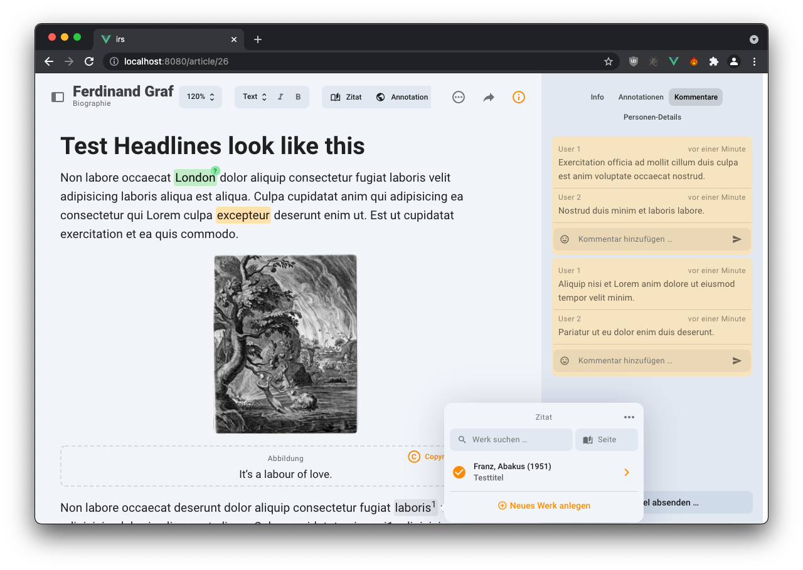

# IRS

## Integriertes Redaktionssystem

The IRS is meant as a system for computer-aided research and data enrichment, publication project tracking and collaborative scientific writing. The application consists of three main parts:

### 1. The Research Tool

*Lemmas* (specifically: persons of historical interest) can be entered manually or batch-imported (from XLS or CSV Files) into the Research Tool. The Research Tool will then try to find the Lemma's [GND](https://en.wikipedia.org/wiki/Integrated_Authority_File) (its norm-data Identifier, the Integrated Authority File). Once found, it triggers an asynchronous scrape job on the server that tries to find additional information on the subject in various catalogues and databases. The scrape job will trigger an Event on the client side once it's done. The additional information is then displayed under "Externe Ressourcen". If a GND could not be found automatically, it can be selected manually.

All Lemmas can be organized into lists/folders (displayed in the left hand side bar) via drag-and-drop. They can be searched and filtered by all their attributes.


### 2. The Issue Manager

Once a Lemma is selected for publication, it can be added to an *Issue* ("Abgabe"). Inside the Issue, an *Article*’s status can change by moving it from column to column. The natural progression of an Article over time would be left-to-right. *Tags* can be used to categorize the Articles further and to add important organizational details (such as the payment status, whether the Article is delayed, etc.). In the Issue Manager, the Articles are assigned to *Editors* and *Authors*, and the progress is tracked.


### 3. The Article Editor

The Article editor is specifically designed for writing, editing and annotating scientific texts. There are three main types of annotations:

- *Comments* (or rather, Comment Threads). Similar to Microsoft Word or Apple Pages.
- *Citations*. Ranges that are linked to a Zotero Item (a publication).
- *Named Entities*. People, places, artifacts, etc. As a basic type, they can have a Relation Type, a Duration and the actual Entity.

The data for *Citations* and for *Named Entities* is stored directly in the document tree, whereas the *Comments* are only referenced with a UUID with their content stored separately on the server.

An Article (document) can currently contain several types of nodes / blocks:

- a text paragraph.
- a first or second order heading.
- an image, inserted via drag and drop or a menu action.
- an audio file, inserted via drag and drop or a menu action.



## Development

### Basics

The application uses [Vue 2.x](https://vuejs.org/v2/guide/) with [Vuetify 2.x](https://vuetifyjs.com/en/introduction/why-vuetify/) as a UI component library, and uses custom UI Elements only if strictly necessary (see [`src/views/lib`](src/views/lib)). All components are written in Typescript with the Class Component Decorators for more idiomatic structure. Tests are run with Cypress. The color scheme of the application is defined in [`src/plugins/vuetify.ts`](src/plugins/vuetify.ts).

For practical development purposes, the following two pieces of software are wholeheartedly recommended:

- [Vetur for Visual Studio Code](https://marketplace.visualstudio.com/items?itemName=octref.vetur)
- [Vue.js Devtools for Google Chrome](https://chrome.google.com/webstore/detail/vuejs-devtools/nhdogjmejiglipccpnnnanhbledajbpd)

### Hosting

The SPA is served from a Node.js based Express server, handling the static files (see [`server/index.ts`](server/index.ts)). The built-in server also performs other (minor) duties (i. e. proxying/caching Zotero responses and providing the "Event Bus" — see below).

### REST API calls / RPC

The Back End provides an OpenAPI (née Swagger) spec. By calling `npm run generate:api-client`, the spec is downloaded and transformed into a statically typed TS API client. All calls to the Back End are then made through this API client. When the client is generated by the [`openapi-typescript-codegen`](https://www.npmjs.com/package/openapi-typescript-codegen) module, we also "inject" a custom request handler, located in [`src/service/request.ts`](src/service/request.ts) which handles things like errors, the login process and request states. During the build phase, it is copied to [`src/api/core/request.ts`](src/api/core/request.ts), and then run from there — thus, if you want to modify the request handler, modify it in [`src/service`](src/service), and then run `npm run generate:api-client` to try it out.

The auto-generated types are also used extensively throughout the code base.

### State Management

The application state is not stored inside a traditional Vuex State Container, but instead in bare Typescript classes located in [`src/store`](src/store). Their instance methods are used to mutate their state. They also subscribe to remote changes and emit events, as described below. In all stores, state variables that can only be mutated by a class member but can be read by the public, are marked `private`, prefixed with an underscore and use a `getter` (but no setter) for public read access. This means the app will not compile if (for instance) a component controller tries to modify a store's state directly.

Currently, all Lemmas are stored, searched and filtered on the client in an IndexedDB table (called `LemmaDb`). On start-up, we fetch the updates, inserts and deletions from the server, and update the local database accordingly (all of this happens in the lemma class / store).

### Real-Time Synchronization

Clients keep each other up to date by connecting to a remote "Event Bus" (a WebSocket server), provided by the built-in Node.js server (see [`server/index.ts`](server/index.ts)). Clients receive Events when the data is changed by another. The Back End can also send specific types of Events by `POST`ing to paths starting with `/message` — for instance when a Lemma's scrape data is updated by the server. This only works if a secret key is provided in the request header. All `NotifyEvents` are statically typed and thus conveniently enumerated in [`src/service/notify.ts`](src/service/notify/notify.ts)`.

### Zotero data caching

Upon initialization the built in server starts caching responses from the Zotero API that rarely change (specifically the `ItemTypeFields` for every type of publication).

### Editor

The Editor component makes heavy use of [ProseMirror](https://prosemirror.net)'s API, data structures and nomenclature both via [TipTap 2](https://tiptap.dev) and directly. Familiarity with the respective APIs is probably necessary for productive development.

## Road Map

- [ ] Use Tokens for authentication instead of HTTP Basic Auth in the header. (Must be coordinated with the Back End)
- [ ] Integrate the editor with the Back End
  - [ ] Save Article (XML)
  - [ ] Load Article (XML)
  - [ ] Comments store
  - [ ] Don't get entities from Lobid, but from APIS.
  - [ ] Run automatic Named Entity Recognition via a spaCy Instance.
  - [ ] Browse previous versions of the Article. (Possibly display diff?)
  - [ ] "Auto Save" with a dedicated flag, so the Back End can differentiate between automatic and intentional saves.
- [ ] Actually upload "Dateien" in the Research Tool Component.
- [ ] Ability to add (Zotero) literature to a Lemma in the Research Tool Component.
- [ ] Create a specialized UI just for Authors, where they can only see and edit their own assigned Articles.
- [ ] Display legacy publication data from Gideon.

## Project setup

```bash
npm install
```

Provide environment variables in `.env.local`:

```bash
cp .env.local.example .env.local
```

### Compiles and hot-reloads for development

```bash
npm run dev
```

### Compiles and minifies for production

```bash
npm run build
```

### Run e2e tests

```bash
npm run test
```

### Lints and fixes files

```bash
npm run lint:fix
```

### Start the server for production

```bash
npm run start
```
