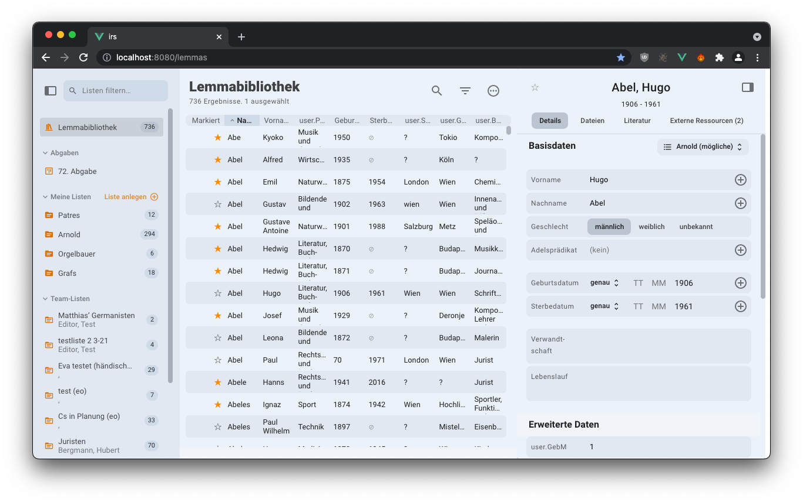
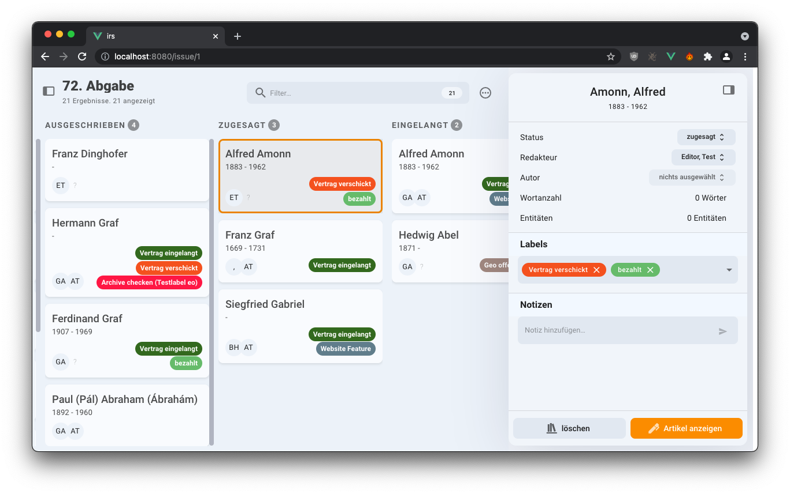

# IRS

## Integriertes Redaktionssystem

The IRS is meant as a system for computer-aided research and data enrichment, publication project
tracking and collaborative scientific writing. The application consists of three main parts:

### 1. The Research Tool

_Lemmas_ (specifically: persons of historical interest) can be entered manually or batch-imported
(from XLS or CSV Files) into the Research Tool. The Research Tool will then try to find the Lemma's
[GND](https://en.wikipedia.org/wiki/Integrated_Authority_File) (its norm-data Identifier, the
Integrated Authority File). Once found, it triggers an asynchronous scrape job on the server that
tries to find additional information on the subject in various catalogues and databases. The scrape
job will trigger an Event on the client side once it's done. The additional information is then
displayed under "Externe Ressourcen". If a GND could not be found automatically, it can be selected
manually.

All Lemmas can be organized into lists/folders (displayed in the left hand side bar) via
drag-and-drop. They can be searched and filtered by all their attributes.

### 2. The Issue Manager

Once a Lemma is selected for publication, it can be added to an _Issue_ ("Abgabe"). Inside the
Issue, an _Article_’s status can change by moving it from column to column. The natural progression
of an Article over time would be left-to-right. _Tags_ can be used to categorize the Articles
further and to add important organizational details (such as the payment status, whether the Article
is delayed, etc.). In the Issue Manager, the Articles are assigned to _Editors_ and _Authors_, and
the progress is tracked.

### 3. The Article Editor

The Article editor is specifically designed for writing, editing and annotating scientific texts.
There are three main types of annotations:

- _Comments_ (or rather, Comment Threads). Similar to Microsoft Word or Apple Pages.
- _Citations_. Ranges that are linked to a Zotero Item (a publication).
- _Named Entities_. People, places, artifacts, etc. As a basic type, they can have a Relation Type,
  a Duration and the actual Entity.

The data for _Citations_ and for _Named Entities_ is stored directly in the document tree, whereas
the _Comments_ are only referenced with a UUID with their content stored separately on the server.

An Article (document) can currently contain several types of nodes / blocks:

- a text paragraph.
- a first or second order heading.
- an image, inserted via drag and drop or a menu action.
- an audio file, inserted via drag and drop or a menu action.

## Development

See [contributing.md](./contributing.md).
